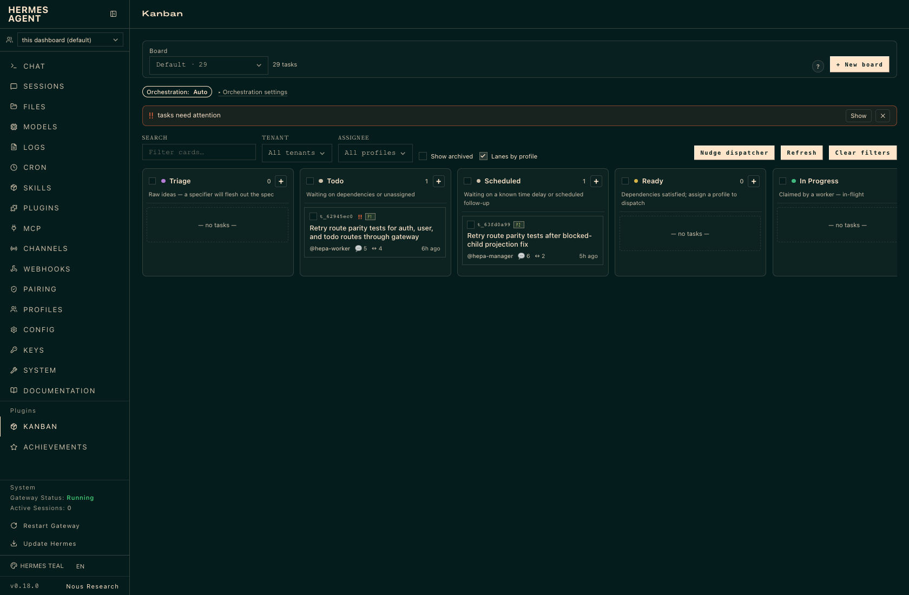
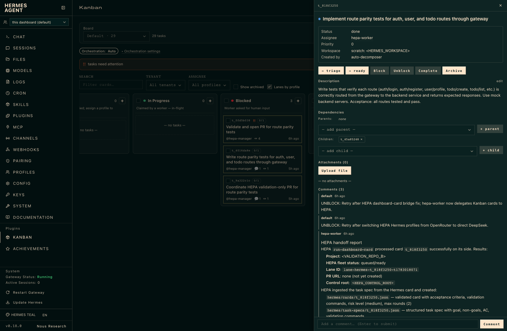
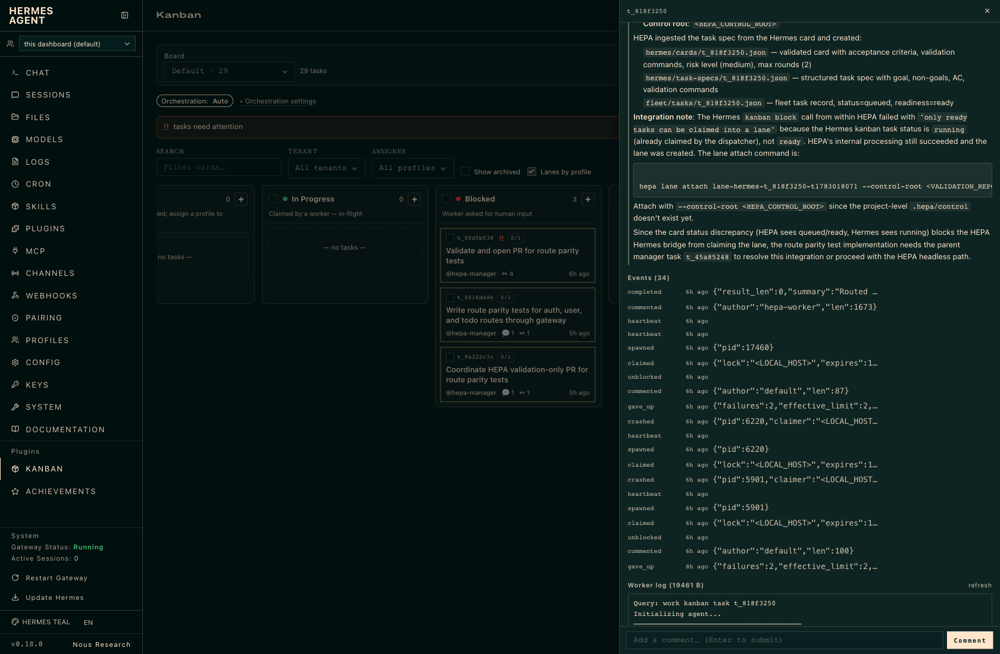
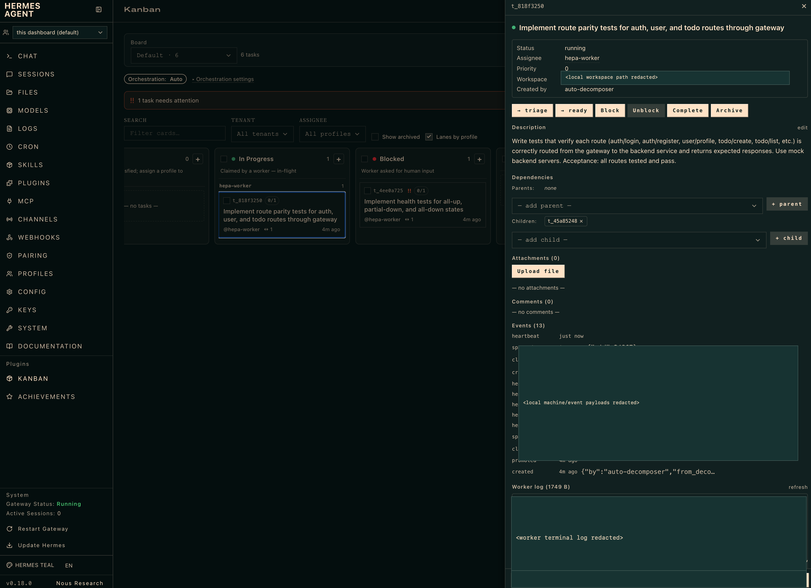

# HEPA

**HEPA — Hermes-Pi-Automata** (inspired by
[HOCA](https://github.com/kaybarax/hoca)) is an independent, Rust-first
engineering automation system: Hermes coordinates the fleet, and the **Pi
Coding Agent** ([pi.dev](https://pi.dev), MIT) is the built-in default harness
that does the actual coding — so any agentic, tool-call-capable cloud or local
model route uses the same adapter path without wiring your own CLI.

HEPA stays **agent-agnostic**: Pi is the default and namesake, **not** a hard
requirement. Every implementation/review agent — Pi, Claude Code, Codex, custom,
or local — routes through the same adapter contract, and no feature privileges
any vendor outside the adapter layer. HOCA is used as a **read-only behavioral
reference and parity-test source**, never as a runtime dependency.

Hermes Kanban/dashboard is the default operator surface for HEPA v1.0.0, while
HEPA's deterministic registry, lane records, artifacts, and state machine remain
authoritative. CLI and headless operation keep working when Hermes is
unavailable — board sync degrades and catches up rather than blocking.

## Relationship to HOCA

| Aspect | HOCA | HEPA |
| --- | --- | --- |
| Implementation | Python + OpenHands | Rust-first, OpenHands dropped |
| Coding agents | OpenHands wrappers | agent-agnostic adapter contract |
| Per-attempt loops | 2 agent loops | 1 agent loop per attempt |
| Containers | 2 per round default | 0 default; container mode opt-in |
| Operator surface | optional bridge | default Hermes Kanban/dashboard |

HEPA carries every HOCA safety gate forward unchanged in behavior. HOCA is the
public inspiration and parity reference for HEPA, while HEPA remains a separate
Rust-first implementation with its own architecture. Divergences are recorded in
commit messages or these docs.

## Rust Workspace

```text
crates/
  hepa-core/       contracts, config, fleet registry, scheduler, governor,
                   conflict planner, fleet monitor, readiness/done gate,
                   notifications, monitor, env allowlist, redaction, hard
                   blockers
  hepa-adapters/   adapter spec/contract, built-ins, routing, engine, doctor,
                   sandbox/container mode, version pinning
  hepa-git/        worktrees, safe staging, manager-owned commit/PR lifecycle
  hepa-review/     review fanout, parser, arbitration, Ralph-V2 repair
  hepa-kanban/     Hermes card mapping, board sync, transitions, spec import
  hepa-memory/     per-project context packs, learning, reward signals
  hepa-cli/        the `hepa` command surface
```

## Quickstart

```bash
# Build and run the local gate (tests + fmt + clippy).
bin/hepa-check

# Import a spec into tasks/cards.
hepa spec import path/to/spec.md

# Register a project and create a task.
hepa project add app-one /path/to/repo --name "App One"
hepa task create app-one task-1 "Fix login redirect"

# Inspect fleet and scheduler state.
hepa scheduler start
hepa scheduler status
hepa fleet status

# Run one task with the fake adapter (test-safe defaults).
hepa run /path/to/repo "Fix login redirect" --agent fake

# Inspect adapters and overall health.
hepa adapter list
hepa doctor

# Install and use the default Pi harness.
hepa adapter install pi
export HEPA_DEFAULT_ADAPTER=pi
export HEPA_PI_MODEL=<provider>/<tool-call-capable-model>
export HEPA_PI_REVIEW_MODEL=
export HEPA_PI_PROVIDER_KEY_ENV=<PROVIDER_API_KEY_ENV>
export PROVIDER_API_KEY_ENV=...
export HEPA_PI_BASE_URL=
hepa run /path/to/repo "Fix login redirect" --agent pi
```

HEPA invokes Pi with `--no-approve`, `--no-session`, and discovery-disabling
flags in non-interactive runs so project-local Pi resources do not expand the
execution surface and HEPA's lane artifact remains the single persistent
transcript.

For a local route, serve a tool-call-capable coding model through an
OpenAI-compatible endpoint. The recommended path is llama.cpp with
chat-template/tool-call support enabled:

```bash
llama-server -m /path/to/model.gguf --host 127.0.0.1 --port 8080 --ctx-size 8192 --jinja

export HEPA_PI_MODEL=llama-cpp/<model-id>
export HEPA_PI_PROVIDER_KEY_ENV=
export HEPA_PI_BASE_URL=http://127.0.0.1:8080/v1
```

When switching a working tree from a local Pi profile back to a cloud profile,
clear stale local overrides such as `HEPA_PI_REVIEW_MODEL` and
`HEPA_PI_BASE_URL`; empty values intentionally override `.env` entries.

Pi local routes must support OpenAI-style tool calling because Pi needs
read/edit/write/bash tool execution to change a repository. HEPA's doctor and
live-run preflight reject known-weak exo + Apple MLX generic local routes until
their endpoint proves the `tools`, `tool_choice`, `tool_calls`, and tool-result
message contract. Local Pi routes derive `cost_class=local`, so they satisfy
`local-only` routing policy once they pass this tool-call readiness gate.

Fleet commands accept `--control-root <path>` to target an isolated control
root (used throughout the test suite).

## Hermes Kanban Workflow

Import a project roadmap/spec into Hermes cards, ask Hermes to hand selected or
ready cards to HEPA, and watch each lane from a terminal while board state stays
reconciled with HEPA's authoritative registry:

```bash
hepa hermes ingest-spec project-1 /path/to/repo path/to/spec.md --max-parallel 4
hepa hermes run-ready project-1 --limit 2 --max-concurrency 2 --agent pi
hepa fleet watch
```

Example Hermes Desktop views from real HEPA Kanban-driven work:









In this workflow Hermes is the visible operator surface: cards move through the
board, task metadata stays inspectable, and the worker log area shows live lane
activity. HEPA remains the authority for task state, lane records, validation,
review, safe staging, and PR creation. The screenshots above are redacted to
hide local machine paths, hostnames, workspace locations, and terminal details.

Board actions are transition *requests*; HEPA validates each before changing
authoritative state. See [docs/hermes-kanban.md](docs/hermes-kanban.md).

Hermes-led runs use bundled manager, worker, reviewer, and review-manager
profiles. The manager profile owns task intake, assignment, bounded
worker/reviewer cycles, and project-specific PR intent; HEPA validates that
intent and performs the safe GitHub operation. Pi is the default coding adapter
in that flow, but review is performed by Hermes reviewer profiles.

## Adapter Setup and Routing

The **Pi adapter** is the batteries-included default harness: `hepa adapter
install pi` installs it and you route it to any agentic, tool-call-capable model
route — cloud or local. Because all execution and review route through the
adapter contract, you can use Pi, Claude Code, Codex, custom, or local adapters
interchangeably — no feature hard-requires a specific vendor CLI. Built-in
adapters, the Pi setup, custom adapter
requirements, version pinning, and `hepa adapter doctor` troubleshooting are
documented in [docs/adapters.md](docs/adapters.md).

## Safety

HEPA never weakens its safety gates: definition-of-ready, safe staging,
secret-path rejection, manager-owned Git lifecycle, worker/reviewer credential
boundaries, env allowlists, the deterministic monitor, bounded rounds, and
default no-auto-merge. See [docs/security-model.md](docs/security-model.md).

## Fleet Usage

The fleet layer schedules tasks across projects under capacity, cost, adapter,
and conflict constraints, and reconciles drift. See [docs/fleet.md](docs/fleet.md)
and [docs/performance.md](docs/performance.md).

## Development Checks

```bash
bin/hepa-check
```

## Installing HEPA

HEPA v1.0.0 publishes prebuilt binaries as GitHub Release assets for macOS
Apple Silicon, macOS Intel, Linux x64, Linux ARM64, and Windows x64. Each
archive contains a `hepa` executable and the release includes a
`SHA256SUMS.txt` checksum manifest. Building from source remains available, but
requires the Rust toolchain. See [docs/releasing.md](docs/releasing.md).
